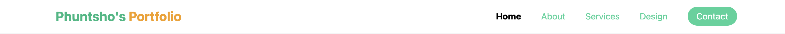
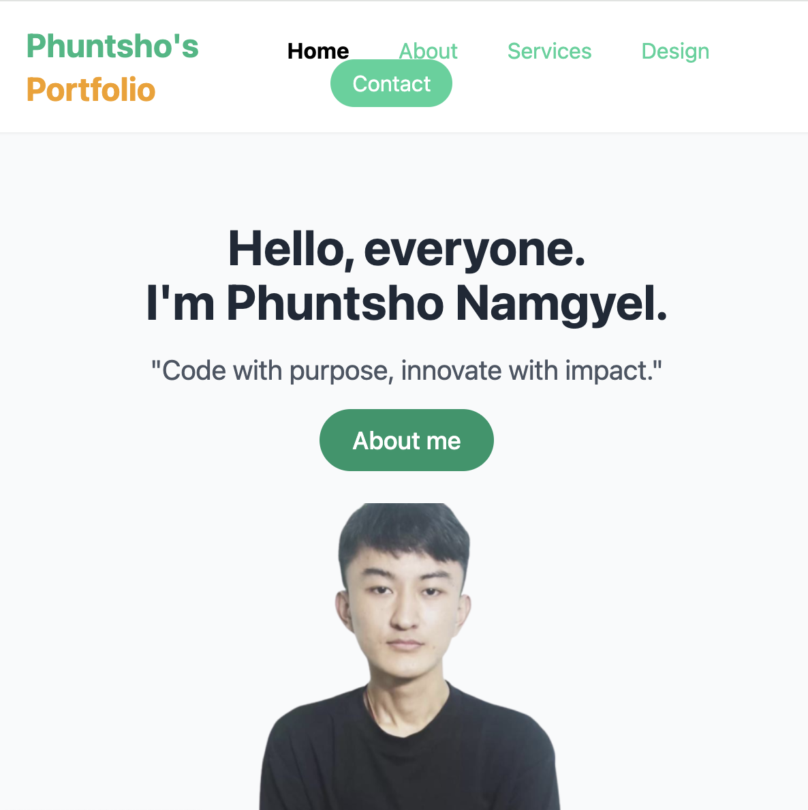
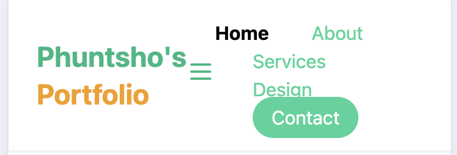

# Main Concepts Applied
In this portfolio project, I applied several key concepts in web development and design:

1. User-Centered Design: I focused on creating an intuitive user experience by structuring the portfolio with five interconnected pages—Home, About, Services, Design, and Contact. This organization ensures that visitors can easily navigate and find relevant information about my work.

2. Utility-First CSS Approach: Utilizing Tailwind CSS allowed me to adopt a utility-first methodology for styling. This approach facilitated rapid prototyping and adjustments by applying predefined classes directly in the HTML, reducing the need for custom CSS and enhancing development efficiency.

3. Semantic HTML: I prioritized the use of semantic HTML elements (such as header, section, and footer) to improve both accessibility and search engine optimization (SEO). This practice not only enhances the structure of the document but also makes it easier for screen readers to interpret the content.

4. Component-Based Design: I implemented a component-based design philosophy, enabling modularity and reusability throughout the portfolio. Each page and section was designed to function as a standalone component, which streamlined updates and maintenance.

5. Responsive Web Design: I ensured the portfolio is fully responsive, offering a seamless user experience across various devices, including desktops, tablets, and mobile phones. Techniques such as media queries, fluid grids, and flexible images were used to adapt the layout to different screen sizes and resolutions.

# New Skills or Knowledge Acquired

This project allowed me to enhance several skills:

1. Mastery of Tailwind CSS: Gaining familiarity with utility-first classes to handle styling without custom CSS, enabling quicker layout changes and a cleaner stylesheet.
2. Layout Structuring: Building a responsive and professional structure through efficient use of containers, padding, and margins in Tailwind.
3. Image Handling for Web: Optimizing images for client and hero sections by adjusting dimensions and applying rounded corners for visual appeal.
4. Responsive Design Techniques: Acquiring hands-on experience with responsive web design principles by using media queries and flexible layouts to ensure compatibility with different screen sizes.

# Reflection
## What I Learned

Throughout the development of my portfolio website, I acquired several new skills and deepened my understanding of various concepts in web design and development:

1. Tailwind CSS Proficiency: Working extensively with Tailwind CSS has significantly enhanced my ability to create visually appealing layouts. I learned how to efficiently utilize utility classes for styling, which streamlined my workflow and allowed for rapid design iterations. This experience gave me confidence in using utility-first CSS frameworks for future projects.

2. Version Control with Git: Managing my project using Git helped me strengthen my version control skills. I became more comfortable with branching, merging, and resolving conflicts. This experience taught me the importance of maintaining a clean and organized codebase, enabling easier collaboration and project management in future endeavors.

3. UI/UX Design Principles: As I worked on the layout and content organization of my portfolio, I developed a better understanding of user interface (UI) and user experience (UX) design principles. I learned to prioritize clarity and simplicity in design, ensuring that users can navigate my website intuitively. This skill is crucial for creating engaging and effective web applications.

4. Content Strategy and Organization: Crafting my portfolio taught me the importance of a coherent content strategy. I learned how to present information in a way that is both engaging and informative, utilizing headings, bullet points, and concise text to guide the user’s journey. This skill will be invaluable in future projects where content presentation plays a key role in user engagement.

5. Responsive Web Design Practices: By focusing on responsiveness, I deepened my understanding of media queries, relative units (e.g., percentages and em/rem), and testing across different devices. This ensures a consistent and optimized experience for all users, regardless of their device.

# Challenges and How I Overcame Them
1. Navigation Structure: Creating an intuitive navigation menu proved to be another challenge. Initially, I used generic link names that did not clearly communicate the purpose of each section. This ambiguity could lead to user frustration and hinder site usability.
* Solution: After gathering feedback, I revised the navigation links to be more descriptive, clearly labeling each section. I organized the menu logically, ensuring that users could easily find the information they were looking for, thus improving the overall navigation experience.

2. Styling Consistency: Maintaining a consistent design across different sections of the website was difficult. For example, the styles for headings, buttons, and text varied between the client testimonials and service descriptions, which created a disjointed look.
* Solution: To achieve visual harmony, I utilized Tailwind CSS's utility-first classes to define a design system for the site. This approach allowed me to apply consistent styling easily and ensured that each element adhered to the same visual standards, resulting in a cohesive appearance throughout the website.

3. Responsive Adjustments: Ensuring the portfolio was fully responsive was challenging, particularly when aligning elements for smaller screen sizes. Certain sections, such as the hero image and navigation bar, required significant adjustments to maintain usability.
* Solution: I implemented media queries to tailor the layout for different screen widths. Additionally, I used relative units and flexbox/grid layouts to create fluid designs that adapt gracefully to various devices. Testing the site on multiple devices and browsers allowed me to identify and fix responsiveness issues effectively.

# Screenshots of Challenges:

